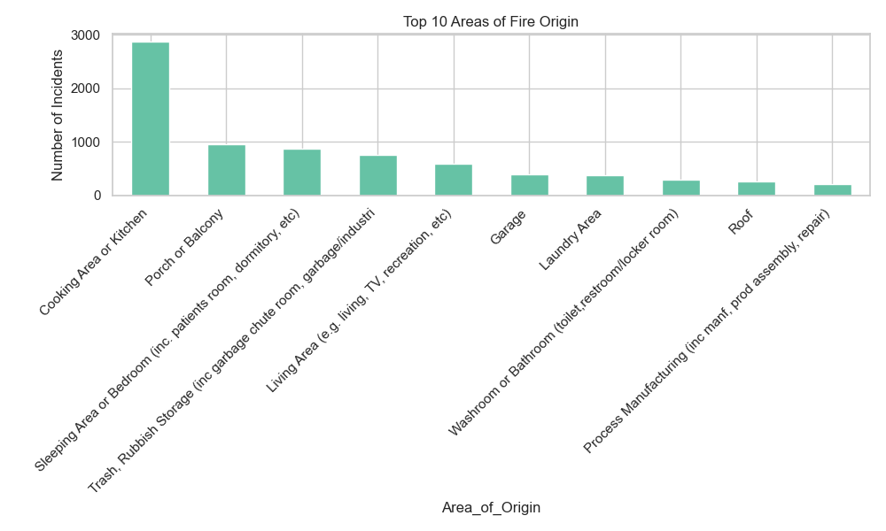
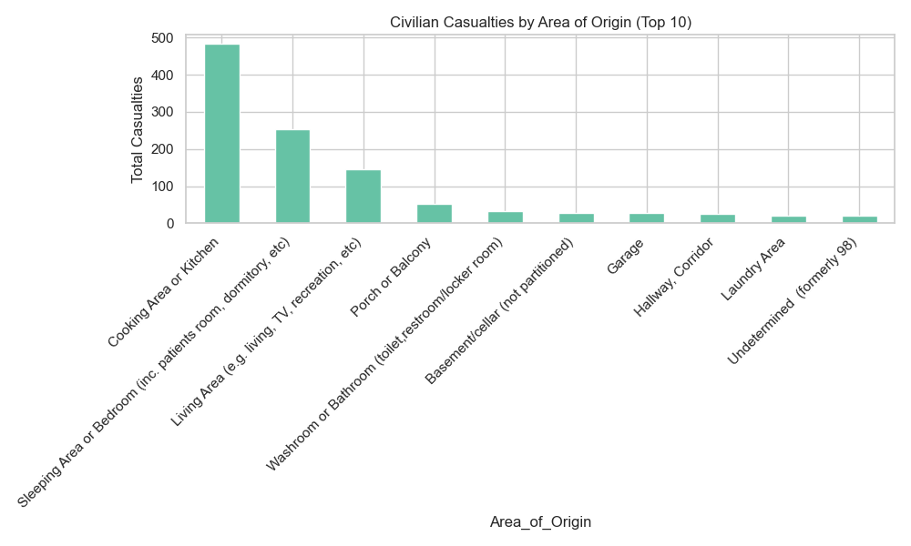
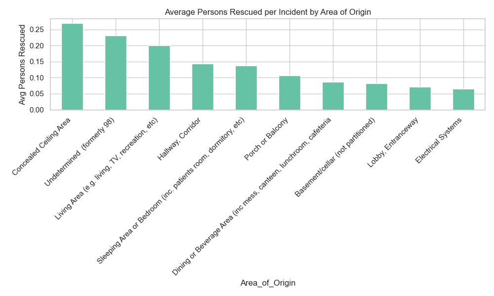
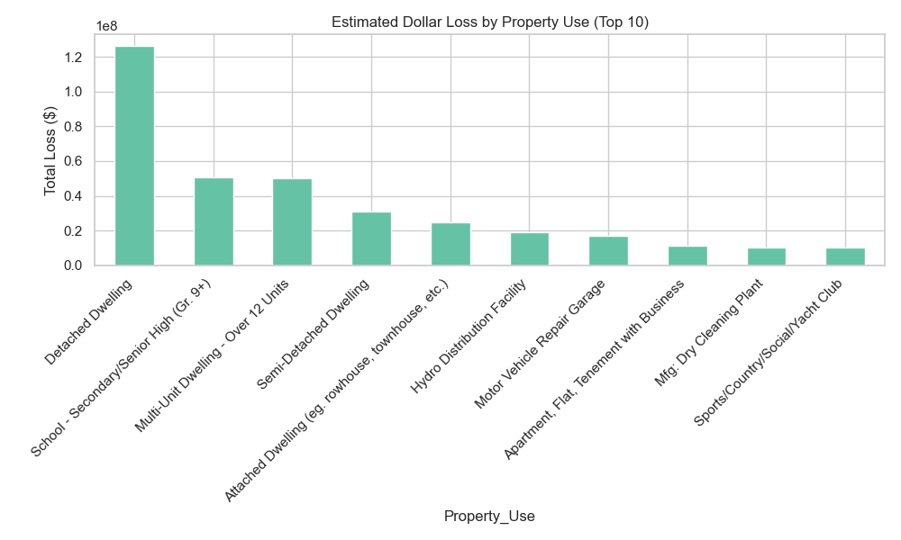

# 🔥 Fire Incidents Analytics
## 📖 Project Overview :

### This project provides a comprehensive analysis of fire incidents using multiple tools and technologies:
SQL Server (SSMS) → Queries for cleaning, transformation, and initial analysis.
Python (Jupyter Notebook & Scripts) → Data exploration, statistical analysis, and chart generation.
Power BI → A multi-page interactive dashboard for stakeholders.
The goal is to uncover key patterns, risk factors, and impacts of fire incidents to support safety management, prevention strategies, and decision-making.

## 🗄️ Data Source :
### The dataset includes detailed records of fire incidents, covering:
Location & Property Use (area of origin, property type).
Incident Details (alarm time, fire under control time, extent of fire).
Human Impact (casualties, displaced persons, rescues).
Financial Impact (estimated dollar loss).
Causes & Ignition Sources (possible causes, risk factors).

---

## 🛠️ Steps & Workflow :
### SQL Analysis :
Cleaned raw tables and handled missing values.
Normalized key fields (e.g., property use, extent of fire).
Extracted KPIs such as total incidents, casualties, and estimated losses.

### Python Analysis :
Loaded cleaned dataset using Pandas.
Created statistical & exploratory charts with Matplotlib & Seaborn.
Exported PNG visuals.

### Power BI Dashboard :
Built a 5-page dashboard with custom theme.
Integrated SQL + Python results.
Added slicers and filters (Property Use, Extent of Fire, Month, etc.).

---

## 📊 Python Charts & Visualizations
### Some of the charts generated in Python and saved under the charts/ folder:
#### Top Areas of Fire Origin :

#### Casualties by Area :

#### Avg Persons Rescued per Incident by Area of Origin :

#### Estimated Dollar Loss by Property Use :

## 📊 Power BI Dashboard Pages :
### The interactive Power BI dashboard consists of 5 pages:
Overview – High-level KPIs (incidents, casualties, displacement, rescues, financial loss).
Human Impact – Detailed breakdown of casualties, rescues, and displacement.
Fire Alarms & Control – Timeline between alarm and control, effectiveness insights.
Causes & Ignition Sources – Analysis of causes, risk factors, and spread.
Financial & Business Impact – Losses across property types and fire extent.
Each page includes cards, charts, and slicers for interactive exploration.

---

## 📂 Repository Structure
fire-incidents-analytics/
│
├── SQL_Queries/                  # SQL scripts
│   ├── fire_queries.sql
│
├── Python_Notebook/              # Python analysis scripts & notebooks
│   ├── fire_analysis.ipynb
│
|── charts/
│   │   ├── area_of_origin.png
│   │   ├── casualties_by_area.png
│   │   ├── displacement_vs_casualties.png
│   │   └── losses_by_property.png
│   |   ... 
│
├── powerbi/            # Power BI files
│   ├── FireIncidentsDashboard.pbix
│   
│
└── README.md

---

## ✅ Key Findings :
**-Kitchens, living rooms, and common areas are the leading fire origins.**
**-Alarm presence & quick control time significantly reduce casualties.**
**-High displacement with low casualties indicates large-scale property loss events.**
**-Financial losses grow exponentially when fires spread beyond the room of origin.**

## 📌 Recommendations :
**-Enforce alarm installation and maintenance in high-risk properties.**
**-Conduct awareness campaigns targeting cooking & electrical fire causes.**
**-Use data dashboards to track incidents and optimize emergency resource allocation.**
**-Monitor response time to fire control as a performance KPI for firefighting units.**

---

## 👨‍💻 Prepared by :

***Mohamed Emad Alhadi | Data Analyst***
📩 mohamedemad24649@gmail.com
